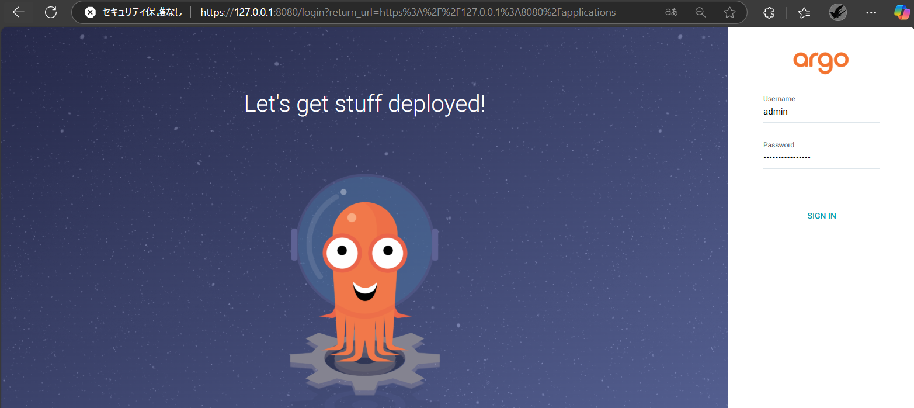
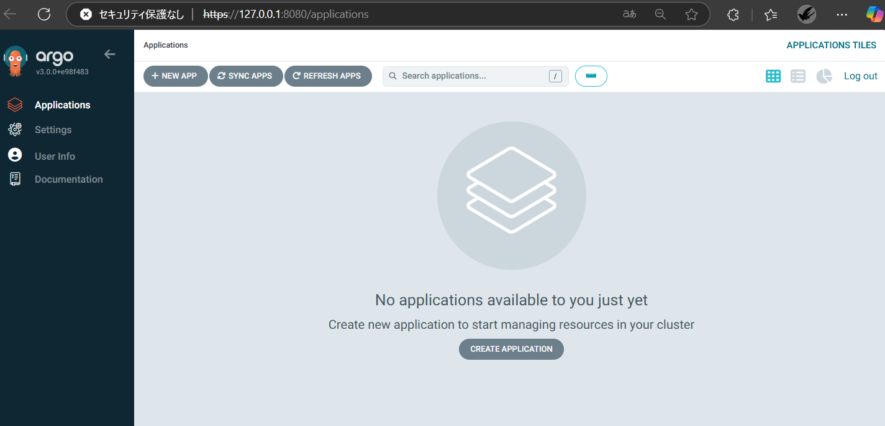

## フェーズ 1：Argo CD を Helm でデプロイする

### 概要

Helm を使用して Argo CD を Kubernetes クラスター上にデプロイし、Web コンソール（UI）にログインできる状態を確認する。

---

### 手順

#### 1. Helm レポジトリの追加と更新

<pre><code>```bash  
helm repo add argo https://argoproj.github.io/argo-helm  
helm repo update
``` </code></pre>

#### 2. Helm レポジトリの追加と更新

以下のコマンドで Argo CD を argocd ネームスペースにデプロイする

<pre><code>
helm install argo-cd argo/argo-cd --namespace argocd --create-namespace
</code></pre>

#### 3. Argo CD UI へのポートフォワーディング

Argo CD の Web UI にローカルからアクセスできるようにポートフォワーディングを行う

<pre><code>  
kubectl port-forward svc/argo-cd-argocd-server -n argocd 8080:443
</code></pre>

#### 4. 初期 admin ユーザーのパスワード取得

以下のコマンドで初期ログインパスワードを取得する

<pre><code>  
kubectl get secret argocd-initial-admin-secret -n argocd -o jsonpath="{.data.password}" | base64 -d  
</code></pre>

#### 5. Argo CD UI にアクセスしてログイン

ブラウザで以下の URL にアクセスし、ユーザー名 admin と先ほど取得したパスワードでログインする

http://localhost:8080

  


---
