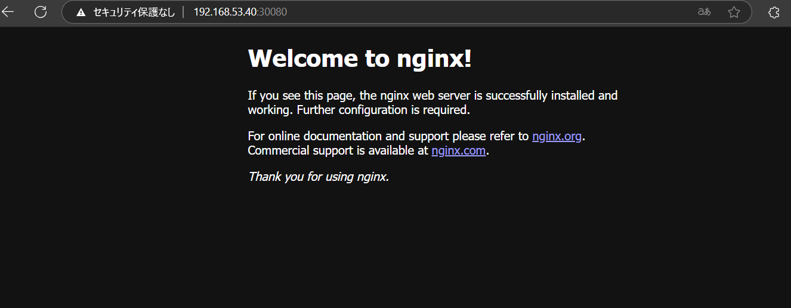

## フェーズ 2：マニフェストファイルを作成する

### 概要

ArgoCD にて自動デプロイするオリジナルの Web ページ元の manifest ファイルを作成する  
※Deployment にて Pod を作成する

---

### 手順

#### 1. manifest ファイルの作成

※本レポジトリの manifest フォルダに格納済

<pre><code>
└── manifest
├── depl.yaml
└── service.yaml
</code></pre>

depl.yaml → Web ページ作成用の Deployment に関する内容を記述  
service.yaml → Pod に接続するための SVC に関する内容を記述

◆depl.yaml

<pre><code>
apiVersion: apps/v1
kind: Deployment
metadata:
  creationTimestamp: null
  labels:
    app: deployment-nginx
  name: deployment-nginx
spec:
  replicas: 2
  selector:
    matchLabels:
      app: deployment-nginx
  strategy: {}
  template:
    metadata:
      creationTimestamp: null
      labels:
        app: deployment-nginx
    spec:
      containers:
      - image: nginx
        name: nginx
        resources: {}
status: {}
</code></pre>

◆service.yaml

<pre><code>
apiVersion: v1
kind: Service
metadata:
  creationTimestamp: null
  labels:
    app: deployment-nginx
  name: nginx-service
spec:
  ports:
    - port: 80
      protocol: TCP
      targetPort: 80
      nodePort: 30080
  type: NodePort
  selector:
    app: deployment-nginx
status:
  loadBalancer: {}
</code></pre>

#### 2. manifest ファイルの apply

以下のコマンドで manifest ファイルを apply する

<pre><code>
kubectl apply -f <yamlファイル格納ディレクトリパス>
</code></pre>

#### 3. Web ページへの接続確認

ブラウザから Web ページが参照できることの確認

<pre><code>
http://<eth0のIPアドレス>:30080/  
</code></pre>

---
