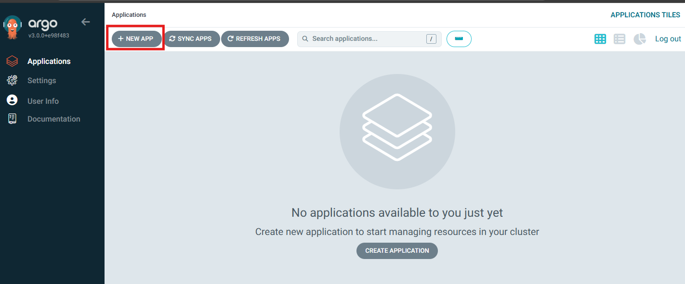
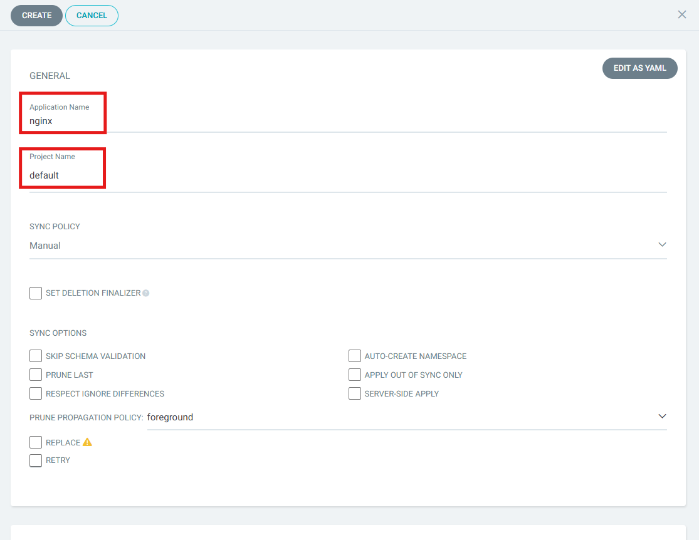
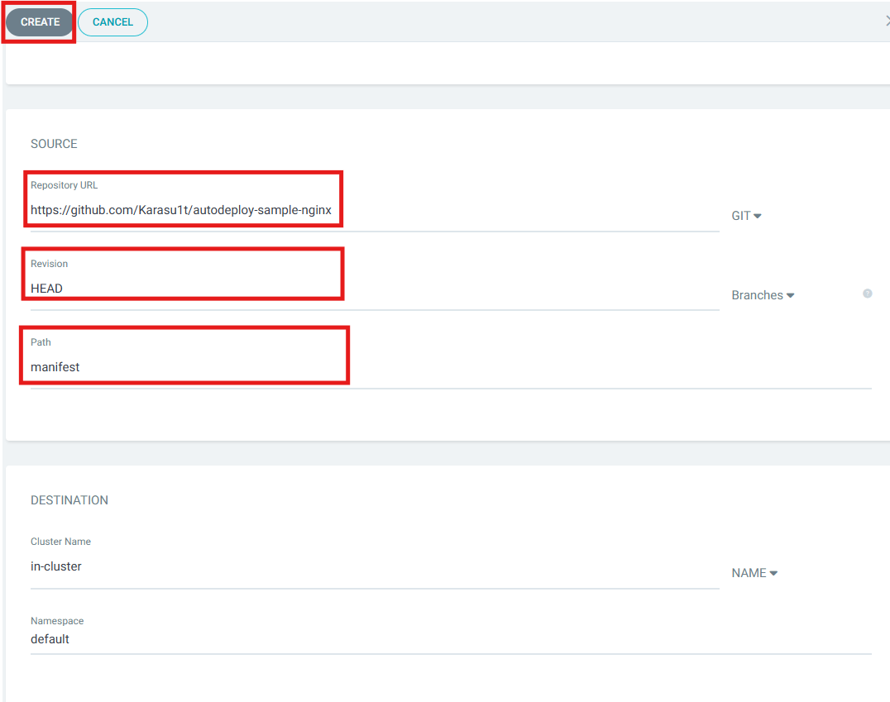
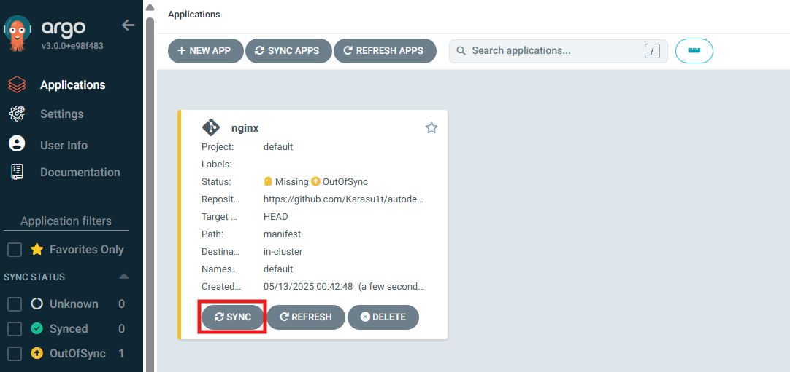
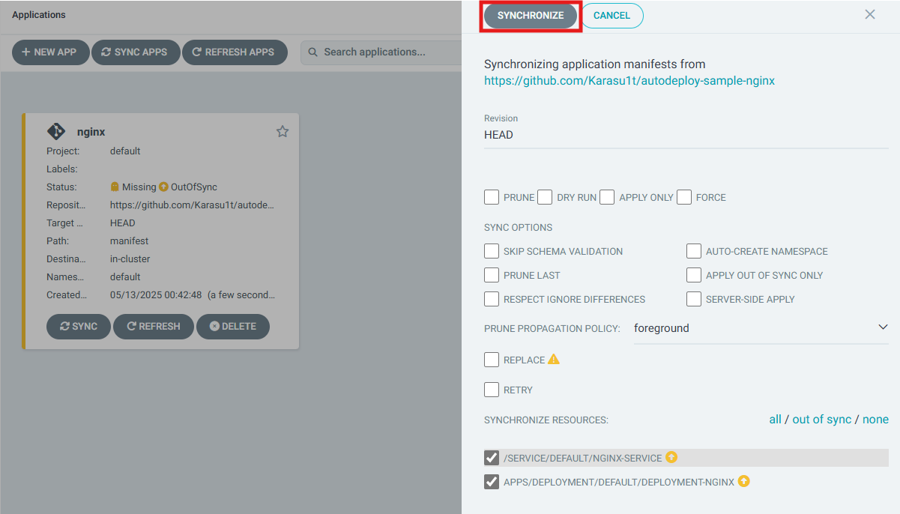
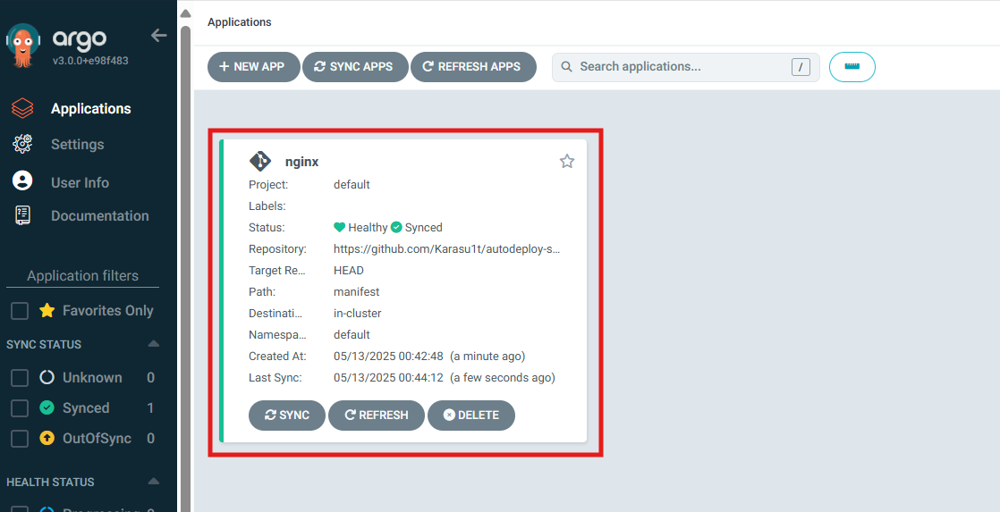
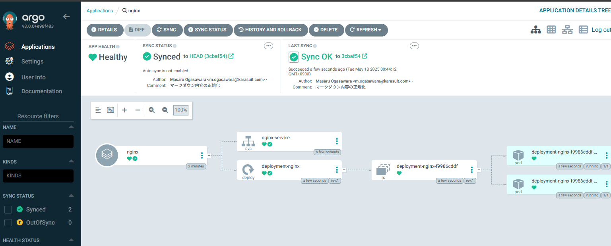
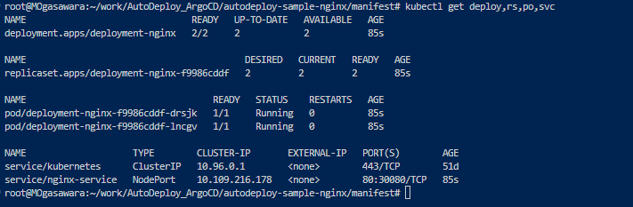
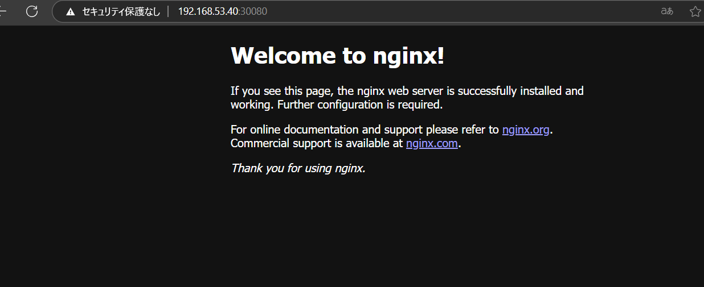

## フェーズ 3：in-cluster 状態で Argo CD から自動デプロイする

### 概要

フェーズ 2 にて apply を手動実行した manifest ファイルを Github 上に格納し、
ArgoCD が上記を参照し、ローカル上の Kubernetes クラスター上で自動デプロイ出来る様にする

---

### 手順

#### 1. ArgoCD のコンソール画面から NEW APP を押下

#### 2. Application Name と Project Name を入力

#### 3. RepositoryURL と Revision、Path を入力し、CREATE を押下

#### 4. SYNC を押下

#### 5. SYNCRONIZE を押下

#### 6. Status が Healthy であることを確認し、赤枠を押下

#### 7. デプロイされた構成が tree 上で確認できる

#### 8. WSL からもデプロイされていることを確認する

#### 9. Web ページへの接続確認

ブラウザから Web ページが参照できることの確認

<pre><code>
http://<eth0のIPアドレス>:30080/  
</code></pre>

※終了後、後続のフェーズと重複するため、APP を削除しておくこと

---
