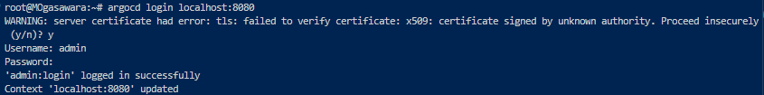
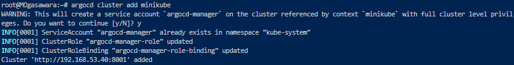
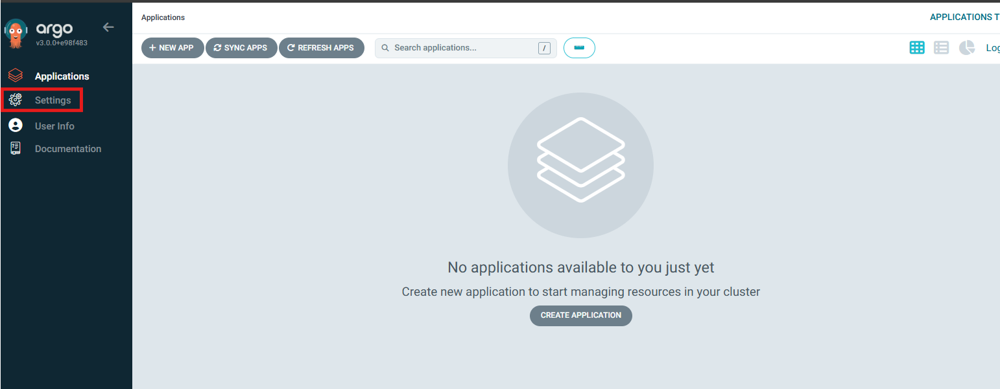
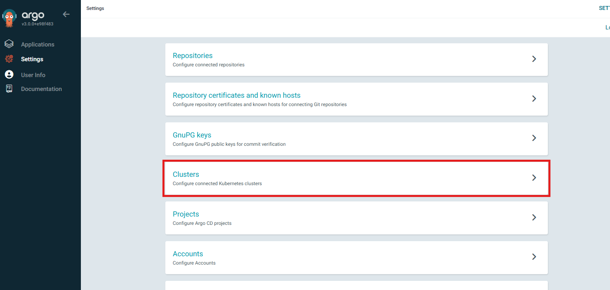
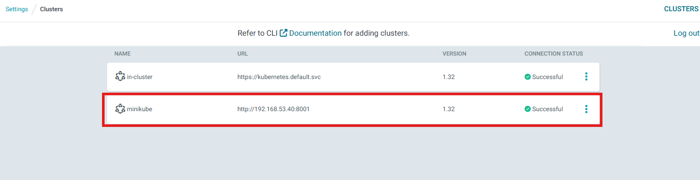
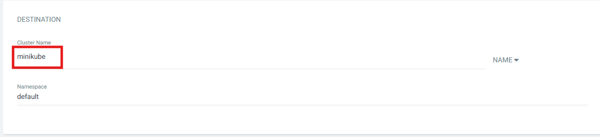
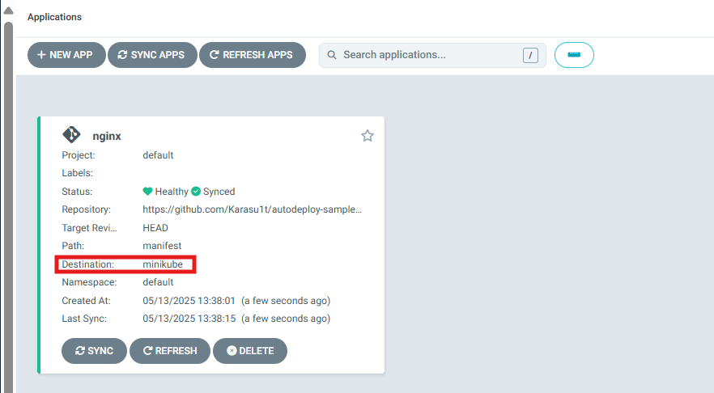
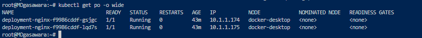

## フェーズ 4：minikube 上に Argo CD から自動デプロイする

### 概要

フェーズ 3 の manifest ファイル Docker-desktop 上ではなく、外部クラスターとして minikube を用意し、  
minikube 上でデプロイできるようにする

---

### 手順

#### 1. CLI 上で ArgoCD にログイン

以下のコマンドで CLI 上から ArgoCD にログインする  
※ポートフォワーディングをフェーズ 1 にて実施していること(ユーザと、パスワードはフェーズ 1 で取得したものを使用)

<pre><code>
argocd login localhost:8080
</code></pre>

#### 2. minikube 起動

以下のコマンドで minikube を起動する
※minikube 起動後、コンテキストが minikube に変更されているので注意

<pre><code>
minikube start
</code></pre>

#### 3. minikube の API サーバーへ HTTP 経由で外部公開

以下のコマンドで minikube の API サーバーへ HTTP 経由で外部公開する  
※minikube の Kubernetes API サーバーに、Docker 上の Argo CD コンテナから直接アクセスする手段がないため暫定的に実施

<pre><code>
kubectl proxy --address='0.0.0.0' --disable-filter=true
</code></pre>

#### 4. WSL の IP アドレスを取得

以下のコマンドで WSL の IP アドレスを取得する

<pre><code>
ip addr | grep eth0
</code></pre>

#### 5. minikube の kubeconfig ファイルの書き換え

以下のコマンドで minikube の kubeconfig 上のサーバ IP アドレスを WSL の IP アドレスに書き換える
※ArgoCD は、minikube クラスターの登録時に minikube の kubeconfig ファイルを参照している

<pre><code>
kubectl config set-cluster minikube --server=http://&lt;WSLのIPアドレス&gt;:8001
</code></pre>

#### 6. minikube の API サーバーへ HTTP 経由で外部公開

以下のコマンドで minikube の API サーバーへ HTTP 経由で外部公開する  
※minikube の Kubernetes API サーバーに、Docker 上の Argo CD コンテナから直接アクセスする手段がないため暫定的に実施

<pre><code>
kubectl proxy --address='0.0.0.0' --disable-filter=true
</code></pre>

#### 7. docker-desktop にコンテキストスイッチする

<pre><code>
kubectl config use-context docker-desktop
</code></pre>

#### 8. ArgoCD に minikube クラスターを登録する

<pre><code>
argocd cluster add minikube
</code></pre>

#### 9. ArgoCD の Setting 画面から minikube クラスターが登録されていることを確認する

#### 10. ArgoCD から manifest ファイルをデプロイする

※でデプロイの流れはフェーズ 2 を参照、以下の箇所のみ変更して登録する

#### 11. 正常性確認

フェーズ 2 の手順と同様に Sync し、Status が Healthy であることを確認

以下の URL をブラウザで開き nginx の画面が表示されることを確認

http://localhost:30080

#### Tips

CLI 上で kubectl get pod -o wide で見ると、node が docker-desktop になっている。

ChatGPT に聞いてみました。

<pre><code>
❓なぜ minikube context なのに docker-desktop につながるの？
これは、minikube が Docker ドライバで起動されていて、内部的には docker-desktop の Node 上で minikube のコンポーネントが動作しているためです。

実際、minikube を Docker ドライバで起動すると、docker container ls で minikube コンテナが見えるはずです。

✅ この状態は「正しい」挙動なのか？
✔️ はい、正しい挙動です
この構成では：

minikube は Docker 上の 1コンテナで動作している 単一ノードの Kubernetes クラスタ

そのコンテナに割り当てられた名前が docker-desktop

kubectl get nodes でその Node 名が表示されている

つまり、docker-desktop という名前の Node は「minikube クラスタのノード」でもある、ということです。

🔁 確認の流れまとめ
確認項目	結果	解釈
kubectl config current-context	minikube	OK
kubectl get nodes	docker-desktop	minikube は docker 上で動いてるので正常
Argo CD の Server	http://192.168.53.40:8001	kubectl proxy 越しでの minikube アクセス

💡補足：Node 名とクラスタ名は無関係
kubectl get nodes は「クラスタ内のノード名」

kubectl config get-contexts で出る minikube は「kubectl が使う接続設定の名前」

argocd cluster add minikube で登録した minikube も「Argo CD 内でのクラスタ参照名」

つまり「Node 名が docker-desktop」なのはあくまで Kubernetes クラスタ内部の話で、クラスタ名としての minikube とは別モノです。

✅ 結論
kubectl get nodes に docker-desktop が出ていても、minikube クラスタに正しく接続されています

Argo CD の destination.name: minikube も正しく動作しています

したがって、「Argo CD 上でデプロイされた Pod が docker-desktop に見える」のは 意図通りの挙動です
</code></pre>

---
