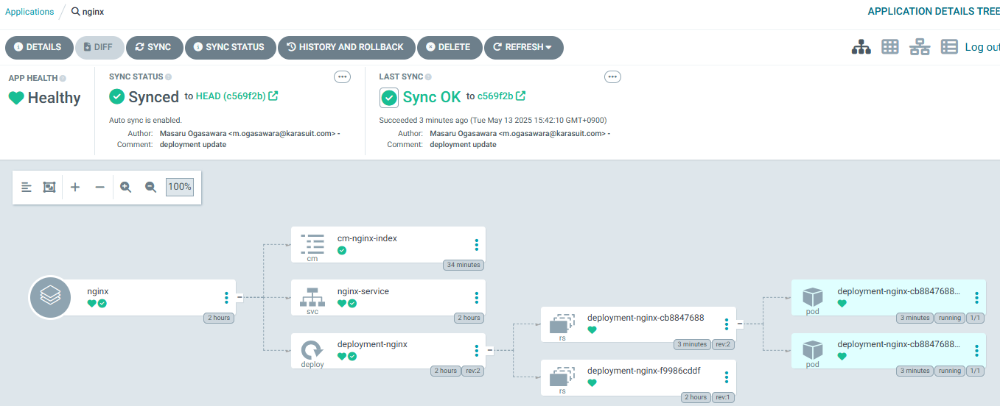
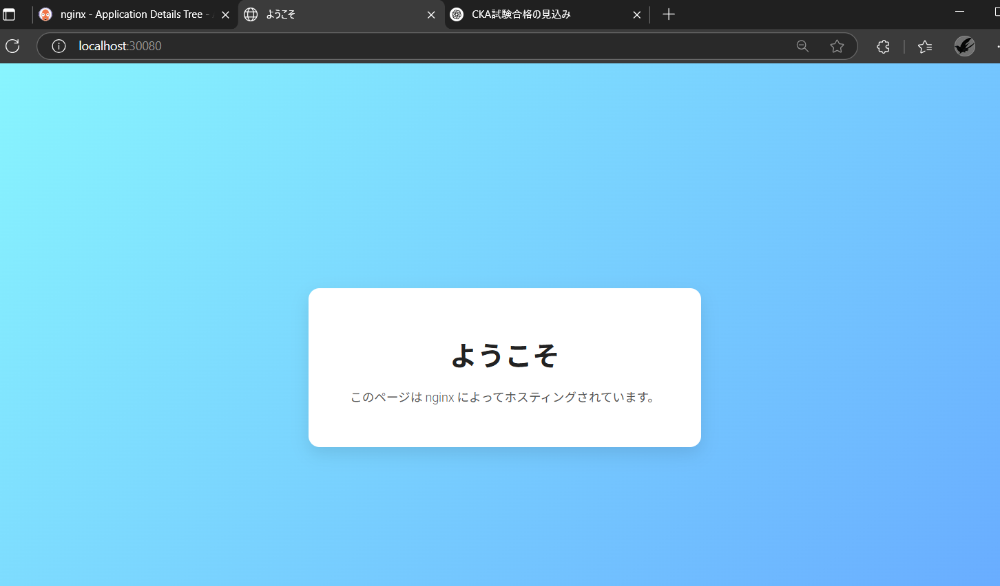

## フェーズ 5：nginx の index.html を更新し、自動デプロイする

### 概要

既に作成済の Deployment を対象に、Github 上のソースコードを変更して、  
実機上の Deployment に更新が入ることを確認する

---

### 手順

#### 1. nignx の index.html 差し替え用ファイルの作成

tree 上で src フォルダを作成し、その中に差し替え用の index.html ファイルを格納  
※index.html の内容については何でも良いのでコードについては割愛(ChatGTP でおしゃれなものを作成してもらった)

<pre><code>
├── manifest
│   ├── configmap.yaml ※NEW  
│   ├── depl.yaml ※Update  
│   └── service.yaml
└── src
    └── index.html ※NEW  
</code></pre>

#### 2. index.html 差し替え用に ConfigMap を作成し、Deployment にアタッチ

◆depl.yaml

<pre><code>
apiVersion: apps/v1
kind: Deployment
metadata:
  creationTimestamp: null
  labels:
    app: deployment-nginx
  name: deployment-nginx
spec:
  replicas: 2
  selector:
    matchLabels:
      app: deployment-nginx
  strategy: {}
  template:
    metadata:
      creationTimestamp: null
      labels:
        app: deployment-nginx
    spec:
      containers:
        - image: nginx
          name: nginx
          volumeMounts:
            - name: index-html
              mountPath: /usr/share/nginx/html/index.html
              subPath: index.html
          resources: {}
  volumes:
    - name: index-html
      configMap:
        name: cm-nginx-index
        items:
          - key: index.html
            path: index.html
status: {}
</code></pre>

◆configmap.yaml

<pre><code>
apiVersion: v1
data:
  index.html: |
    <!DOCTYPE html>
    <html lang="ja">
      <head>
        <meta charset="UTF-8" />
        <meta name="viewport" content="width=device-width, initial-scale=1.0" />
        <title>ようこそ</title>
        <link
          href="https://fonts.googleapis.com/css2?family=Roboto:wght@300;700&display=swap"
          rel="stylesheet"
        />
        

      </head>
      <body>
        

          <h1>ようこそ</h1>
          
このページは nginx によってホスティングされています。

        

      </body>
    </html>

kind: ConfigMap
metadata:
creationTimestamp: null
name: cm-nginx-index
namespace: default
</code></pre>

#### 3. 更新したソースコード一式を Github レポジトリに Push

#### 4. ArgoCD で自動デプロイされていることを確認する
※Pushしてから数分待つ必要がある
※予めAutoSyncを有効化してください

